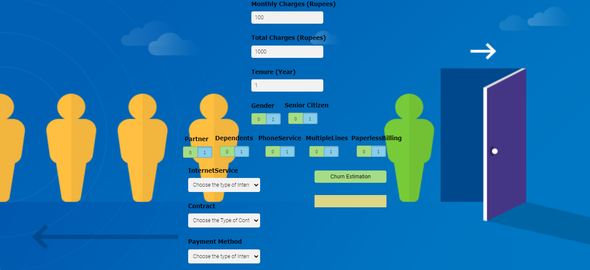

# Churn-Prediction-Web-Application-using-Deep-Learning

## Description
Customer churn prediction is to measure why customers are leaving a business. In this project I have looked at customer churn in telecom business. I have build a deep learning model to predict the churn and use precision,recall, f1-score to measure performance of my model.

## Dataset
I have collected the Dataset from Kaggle Website in which Customer account information- how long they’ve been a customer, contract, payment method, paperless billing, monthly charges, and total charges Demographic info about customers – gender, age range, and if they have partners and dependents. Services that each customer has signed up for – phone, multiple lines, internet, online security, online backup, device protection, tech support, and streaming TV and movies etc. given in thhe form of 7043*21 size data.

## Implentation
I have gone through several steps like Data Preprocessing, Data cleaning, Feature Engineering and Model building and I have then handle the Imbalance data using several techniques to improve the score of the minority and majority class and improve the overall f1 score. 
With the help of flask I have builded a web application.

## Technologies used

1. Prgramming Language - Python 3.8
2. Libraries - Pandas, NumPy, Seaborn
3. Deep Learning Framework - Tensorflow 2.3
4. Web Technology - Flask, HTML5, CSS, JavaScript.
