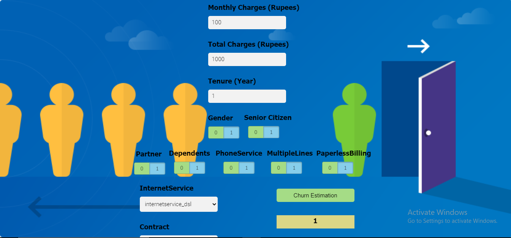

# Churn-Prediction-Using-Artificial-Neural-Network

Customer churn prediction is to measure why customers are leaving a business. In this project I have looked at customer churn in telecom business. I have build a deep learning model to predict the churn and use precision,recall, f1-score to measure performance of our model.
I have then handle imbalance in data using SMOTE techniques and improve f1-score
Later I have devloped the web application.

Technologies used-

Prgramming Language - Python 3.8
Python Library - Pandas, NumPy
Deep Learning Library - Tensorflow 2.0 for Model Building
Machine Learning Library - Scikit-Learn for confusion_matrix and classification_report
Web Technology - Flask, HTML5, CSS, JavaScript.
